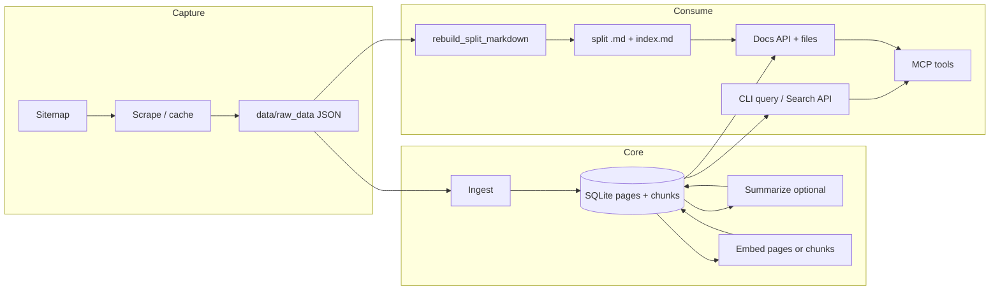

# OpenAI Docs Scraper — project guide

This document describes how the repository is organized, how data pipelines fit together, how to run everything from scratch, how to refresh data, and how to use the **REST API** and **MCP** interfaces.

---

## Table of contents

1. [What this project does](#what-this-project-does)
2. [Repository layout](#repository-layout)
3. [Data directories and SQLite](#data-directories-and-sqlite)
4. [Configuration (environment)](#configuration-environment)
5. [Pipelines (how they connect)](#pipelines-how-they-connect)
6. [Full pipeline: 0 → 100](#full-pipeline-0--100)
7. [Updating data (incremental & full refresh)](#updating-data-incremental--full-refresh)
8. [REST API reference](#rest-api-reference)
9. [MCP server](#mcp-server)
10. [Docker](#docker)
11. [Troubleshooting](#troubleshooting)
12. [Publishing to GitHub](#publishing-to-github-public-repo)
13. [Sharing scraped data](#sharing-scraped-data-optional)

---

## What this project does

- **Capture** OpenAI Platform documentation (browser scrape → JSON cache, or use existing cache).
- **Ingest** cached pages into **SQLite** (`pages`, `chunks`, full-text index on chunks).
- **Summarize** pages with OpenAI (optional but recommended for navigation blurbs and **page-level** semantic search).
- **Embed** either **page summaries** or **chunk bodies** for vector search.
- **Search** locally (CLI or HTTP API) over summaries or chunks.
- **Export** a monolithic Markdown book and/or a **split bundle** (`index.md` + one `.md` per URL path) for reading and for the docs API/MCP file endpoints.

---

## Repository layout

| Area | Path | Role |
|------|------|------|
| Library code | `src/openai_docs_scraper/` | Scrape, ingest, extract, DB, embeddings, search, book export, FastAPI app, MCP server |
| CLI / batch scripts | `scripts/` | `run_ingest`, `run_summarize`, `run_embed`, `query`, `rebuild_split_markdown`, `export_book`, `run_mcp`, etc. |
| Local data (gitignored typical) | `data/` | `raw_data/`, `docs.sqlite3`, `openai_docs_split_rebuilt/`, `sitemap.xml`, optional `openai_docs_book.md` |
| HTTP API entry | `openai_docs_scraper.api.main:app` | Uvicorn / Docker |
| Cursor MCP config (example) | `.cursor/mcp.json` | stdio MCP to `scripts/run_mcp.py` |

---

## Data directories and SQLite

- **`data/raw_data/*.json`** — One file per scraped URL (HTML and metadata). **Source of truth** for re-extracting clean Markdown in `rebuild_split_markdown.py`.
- **`data/docs.sqlite3`** — `pages` (plain text, summaries, optional page embeddings) and `chunks` (chunk text, optional chunk embeddings). FTS5 on chunk text.
- **`data/openai_docs_split_rebuilt/`** (or your chosen `MD_EXPORT_ROOT`) — Split export: **`index.md`** plus paths like `guides/structured-outputs.md`. Used by **`/docs/*`** API routes and MCP **`get_doc_file`** / **`get_navigation_index`**.
- **`data/sitemap.xml`** — URL ordering / completeness for exports (fetch via project API or your own download).

---

## Configuration (environment)

Settings use **`pydantic-settings`**: defaults in code, override with env vars or a **`.env`** file at the repo root (loaded where `openai_docs_scraper.env` / `get_settings()` is used).

| Variable | Default (typical) | Meaning |
|----------|-------------------|---------|
| `OPENAI_API_KEY` | — | Required for summarize, embed, and semantic **search** |
| `DB_PATH` | `data/docs.sqlite3` | SQLite database path |
| `RAW_DIR` | `data/raw_data` | Directory of cached JSON pages |
| `MD_EXPORT_ROOT` | `data/openai_docs_split_rebuilt` | Split Markdown root (`index.md`, `**/*.md`) |
| `SITEMAP_PATH` | `data/sitemap.xml` | Local sitemap file path |
| **`MCP_HOST` / `MCP_PORT`** | `127.0.0.1` / `8001` | HTTP bind for MCP SSE (also **`FASTMCP_*`**) |

**Docker** (`docker-compose.yml`) sets `DB_PATH`, `MD_EXPORT_ROOT`, `RAW_DIR`, `SITEMAP_PATH` under **`/data/...`** and mounts **`./data:/data`**.

---

## Pipelines (how they connect)



- **Semantic search** (`target=pages`) uses **embeddings of `pages.summary`**.
- **Semantic search** (`target=chunks`) uses **embeddings of `chunks.chunk_text`** (run **`run_embed --target chunks`** first).

---

## Full pipeline: 0 → 100

Run from repo root with venv active. Use **`PYTHONPATH=src`** when invoking `scripts/*.py` as files.

### 1) Optional: create DB + sitemap

```bash
PYTHONPATH=src python scripts/init_project.py
# Or use POST /project/init and /project/sitemap/fetch via API
```

### 2) Get raw HTML into `data/raw_data`

Either:

- **Scrape** (browser stack; heavy): `PYTHONPATH=src python scripts/run_scrape.py ...`, **or**
- Copy/sync JSON caches from an existing mirror into **`data/raw_data`**.

### 3) Ingest → SQLite + chunks

```bash
PYTHONPATH=src python scripts/run_ingest.py --force
```

### 4) Summaries (OpenAI)

```bash
PYTHONPATH=src python scripts/run_summarize.py -n 500
```

### 5) Embeddings

- For **page-summary search** (`--target pages` / API `target=pages`):

```bash
PYTHONPATH=src python scripts/run_embed.py --target pages -n 2000
```

- For **chunk-level search**:

```bash
PYTHONPATH=src python scripts/run_embed.py --target chunks -n 5000
```

### 6) Optional: monolithic book

```bash
PYTHONPATH=src python scripts/export_book.py
```

### 7) Split Markdown bundle + index (recommended for API/MCP readers)

Rebuild clean split files from **`raw_data`** (and optionally OpenAI blurbs for `index.md`):

```bash
PYTHONPATH=src python scripts/rebuild_split_markdown.py --openai-index
```

### 8) Query / API / MCP

- CLI: `PYTHONPATH=src python scripts/query.py -q "..." -k 8 --target pages`
- HTTP: `docker compose up docs-api` → `http://localhost:8000/docs` (Swagger)
- MCP: stdio via Cursor or `scripts/run_mcp.py`; SSE via `docs-mcp` on port **8001**

---

## Updating data (incremental & full refresh)

### Refresh after new scrapes

1. Ingest new/overwritten JSON: `run_ingest.py` (add **`--force`** to rewrite even if hash unchanged).
2. Re-run **`run_summarize.py`** for pages missing summaries (**`--force`** to redo all).
3. Re-run **`run_embed.py`** with **`--force`** if text/summary changed so vectors stay aligned.

### Refresh split Markdown only

- **`rebuild_split_markdown.py`** — Re-reads `**Source:**` URLs from an input split dir, pulls HTML from **`raw_data`**, rewrites **`--out-dir`**. Use **`--openai-index`** to regenerate **`index.md`** blurbs (OpenAI).

### Refresh navigation index without full rebuild

- **`scripts/refresh_doc_index.py`** — Regenerate **`index.md`** under a given export root.

### When OpenAI docs change a lot

Prefer a **full pass**: scrape/update **`raw_data`** → **`run_ingest --force`** → summarize → embed → rebuild split export.

---

## REST API reference

**Interactive docs:** `GET /docs` (Swagger UI) and `/redoc` when the app is running.

**Global**

| Method | Path | Purpose |
|--------|------|---------|
| GET | `/health` | Liveness + `db_exists`, `index_md_exists` |
| GET | `/config` | Resolved `db_path`, `md_export_root`, `raw_dir`, default models (no secrets) |

**Search** (`/search`)

| Method | Path | Notes |
|--------|------|--------|
| GET | `/search/query` | Query params: `q`, `k`, `target` (`chunks`\|`pages`), `fts`, `no_embed`, `group_pages`, `embedding_model`, `db_path` (optional) |
| POST | `/search/query` | JSON body: see `SearchRequest` in `api/schemas.py` |

**`SearchResponse` (highlight)** includes: `hits[]` with `url`, `title`, `summary`, `chunk_text`, `score`, `source_path`, `md_relpath`, `export_abs_path`, `export_file_exists`, plus `db_path`, `target`, `embedding_model`, `fts`, `no_embed`, `group_pages`.

If **`db_path`** is omitted in Docker, the server uses **`DB_PATH`** from the environment (see `api/deps.py`).

**Docs reader** (`/docs`)

| Method | Path | Purpose |
|--------|------|---------|
| GET | `/docs/index` | Full `index.md` from `MD_EXPORT_ROOT` |
| GET | `/docs/catalog` | All `pages` rows + derived `md_relpath` |
| GET | `/docs/stats` | Counts and export health |
| GET | `/docs/export/file/{file_path}` | Read `.md` under export root (no `..`) |
| GET | `/docs/raw/file/{file_path}` | Read file under `RAW_DIR` (cached JSON, etc.) |

**Project / scrape / ingest / process** — See Swagger for `InitProjectRequest`, `IngestRequest`, `SummarizeRequest`, `EmbedRequest`, etc. Path-like fields can usually be omitted in Docker so **`DB_PATH` / `RAW_DIR` / `SITEMAP_PATH`** apply.

**Example (search)**

```bash
curl -s 'http://localhost:8000/search/query?q=structured+outputs&k=5&target=pages' | jq
```

**Example (read export file)**

```bash
curl -s 'http://localhost:8000/docs/export/file/guides/structured-outputs.md' | jq -r '.content' | head
```

---

## MCP server

### Tools (agent-facing)

| Tool | Role |
|------|------|
| `search_docs` | Semantic search; args: `query`, `k`, `target` (`pages`\|`chunks`), `fts_prefilter` |
| `get_doc_file` | Read full Markdown: `md_relpath` e.g. `guides/foo.md` |
| `get_page_by_url` | Same as file read, keyed by canonical platform URL |
| `get_navigation_index` | Raw `index.md` text |
| `get_catalog` | Optional `section` filter; JSON list of pages |
| `get_stats` | JSON DB/export stats |

`search_docs` returns a **JSON string** of hits (MCP transports text).

### Transports

1. **stdio** (default) — Cursor / Claude Desktop spawn `scripts/run_mcp.py` without `--sse`. Example: `.cursor/mcp.json` with `command`, `args`, `env` (`PYTHONPATH`, `DB_PATH`, …).

2. **SSE** — `scripts/run_mcp.py --sse` or Docker service **`docs-mcp`**. Endpoint base: **`http://<host>:8001/sse`** (FastMCP default path; messages under **`/messages/`**).

Bind: **`MCP_HOST`**, **`MCP_PORT`** (or **`FASTMCP_HOST`**, **`FASTMCP_PORT`**).

### Quick tests

```bash
# stdio smoke (default tool: get_stats)
PYTHONPATH=src .venv/bin/python scripts/test_mcp_client.py --stdio

# HTTP SSE (after: docker compose up docs-mcp)
PYTHONPATH=src .venv/bin/python scripts/test_mcp_client.py --url http://127.0.0.1:8001/sse
```

**Official client handshake only:**

```bash
.venv/bin/python -m mcp.client http://127.0.0.1:8001/sse
```

---

## Docker

```bash
docker compose up --build -d
```

| Service | Port | Command / notes |
|---------|------|------------------|
| `docs-api` | **8000** | Uvicorn: `openai_docs_scraper.api.main:app` |
| `docs-mcp` | **8001** | `python scripts/run_mcp.py --sse` |

Mount **`./data:/data`**; set env for **`DB_PATH`**, **`MD_EXPORT_ROOT`**, **`RAW_DIR`**, **`OPENAI_API_KEY`**, etc.

Rebuild images after dependency or code changes.

---

## Troubleshooting

| Symptom | Likely cause | What to do |
|---------|--------------|------------|
| Search returns nothing | Wrong **target** vs what you embedded | Use **`target=pages`** after `run_embed --target pages`; **`target=chunks`** needs chunk embeddings |
| `temperature` / model errors on summarize | Model doesn’t support parameter | Current code omits `temperature` for Responses API compatibility |
| API **unable to open database file** (Docker) | Default `db_path` pointed at `/app/...` | Omit `db_path` in requests or set **`DB_PATH=/data/docs.sqlite3`** (compose already does) |
| MCP Docker crash on `run()` | Old `host=` on `run()` | Fixed: host/port go on **`FastMCP(...)`**; use current `mcp_server.py` |
| `get_doc_file` 404 | Export missing | Run **`rebuild_split_markdown`** into **`MD_EXPORT_ROOT`** |

---

## Publishing to GitHub (public repo)

The codebase is suitable for a **public** repo if you **do not** commit secrets or heavy corpora.

**Already ignored (see `.gitignore`):**

- **`.env`** — copy from **`.env.example`** after clone.
- **`data/`** — scraped HTML/JSON, SQLite, split exports (large; each user builds locally or mounts a volume).
- **`.venv/`**, **`*.sqlite3`**, **`*.egg-info`**, **`dist/`**, **`build/`**
- **`.cursor/mcp.json`** — often contains **absolute paths**; do not commit.

**Do commit:**

- `src/`, `scripts/`, `pyproject.toml`, `README.md`, `docs/`, `Dockerfile`, `docker-compose.yml`, `.dockerignore`, `.env.example`, **`.cursor/mcp.json.example`**, **`LICENSE`**

**Suggested first push:**

```bash
cd /path/to/openai-docs-scraper
git init
git add .
git status   # confirm no .env, no data/, no .venv
git commit -m "Initial public release: scraper, API, MCP, ops guide"
git branch -M main
git remote add origin https://github.com/YOU/openai-docs-scraper.git
git push -u origin main
```

**Before pushing:** replace **`LICENSE`** copyright line with your name/org if you want.

**Cursor MCP after clone:** copy **`.cursor/mcp.json.example`** → **`.cursor/mcp.json`** and fix `command` if your venv isn’t at `.venv/` (or if `${workspaceFolder}` isn’t expanded—use absolute paths locally).

**Compliance / optics:** describe in the README that this project **mirrors tooling for personal/local use** of the OpenAI **public docs**, respects their Terms, and **does not** redistribute scraped content as an official product. Users still build their own copy from network or cache.

---

## Sharing scraped data (optional)

You **do not** have to publish scraped files for the **code** repo to be useful: others can run the scraper/ingest pipeline themselves. If you still want to **host a copy** of what you built (faster onboarding, demos, offline bundles), treat it as a **separate concern** from the main repository.

### Legal / policy (read this first)

OpenAI’s **Terms of Use**, **robots.txt**, and **copyright** apply to `platform.openai.com` content. **Redistributing** full HTML/Markdown mirrors publicly may **not** be allowed or may require permission. This project does not provide legal advice: **check current OpenAI policies** and, if unsure, **keep snapshots private** or share only what you are explicitly permitted to share.

### Why not put `data/` in the same Git repo

- **Size** — `raw_data/` JSON, SQLite, and split exports can be **hundreds of MB or more**; every clone would pull it.
- **Churn** — doc updates make **large diffs** and noisy history.
- **Separation** — code (MIT) vs **third-party text** may deserve different licensing/attribution.

Keeping **`data/` gitignored** on the **code** repo remains the default recommendation.

### Practical ways to “push it somewhere”

| Approach | Good for | Caveats |
|----------|----------|---------|
| **GitHub Release asset** | Occasional snapshots (zip/tar of `data/raw_data` and/or a prebuilt `docs.sqlite3` + split export) | Still subject to **ToS**; keep **under ~2 GB** per file (GitHub limit); document version/date in release notes. |
| **Separate GitHub repo** | `yourname/openai-docs-mirror-data` with its own README + license notice | Same **legal** questions; still large for plain Git — prefer **Release** or **LFS**. |
| **Git LFS** | If you insist on Git for blobs | **Quota/billing** on GitHub; clones need LFS; not great for huge trees. |
| **Hugging Face Datasets / cloud bucket** | Large public or gated datasets | Clear **license** and **provenance**; optional gated access if you only want to share with vetted users. |
| **Private storage only** | Team backup, personal use | S3/GCS/Drive; no public redistribution issue if you don’t publish. |

### What bundle to publish (if you proceed)

- **Minimal reproducibility:** `data/raw_data/*.json` only — others run **`run_ingest` → summarize/embed → rebuild** themselves.
- **Faster for users:** add **`docs.sqlite3`** (already ingested + optional summaries/embeddings) **and/or** the **split Markdown tree** under `openai_docs_split_rebuilt/` — much larger, but **no scrape** step.
- **Smallest footprint:** a **manifest** (URL list + content hash + scrape time) without bodies — useful for auditing, not for reading.

### Suggested workflow (snapshot release)

1. Freeze a date in the filename, e.g. `openai-docs-data-2026-03-30.tar.zst`.
2. Include a **`MANIFEST.txt`** inside the archive: snapshot date, commit hash of the **scraper** repo, approximate page count, and a line that content is **unofficial** and users must comply with **OpenAI’s terms**.
3. Attach to a **GitHub Release** on the **code** repo *or* publish from a **dedicated data** repo / HF / bucket.
4. Link from the main **README** (“optional data snapshot”) without vendoring the archive into Git history.

---

## Further reading

- OpenAPI: run the API and open **`/docs`**.
- Schemas: `src/openai_docs_scraper/api/schemas.py`
- Search logic: `src/openai_docs_scraper/services/search.py`, `src/openai_docs_scraper/search.py`
